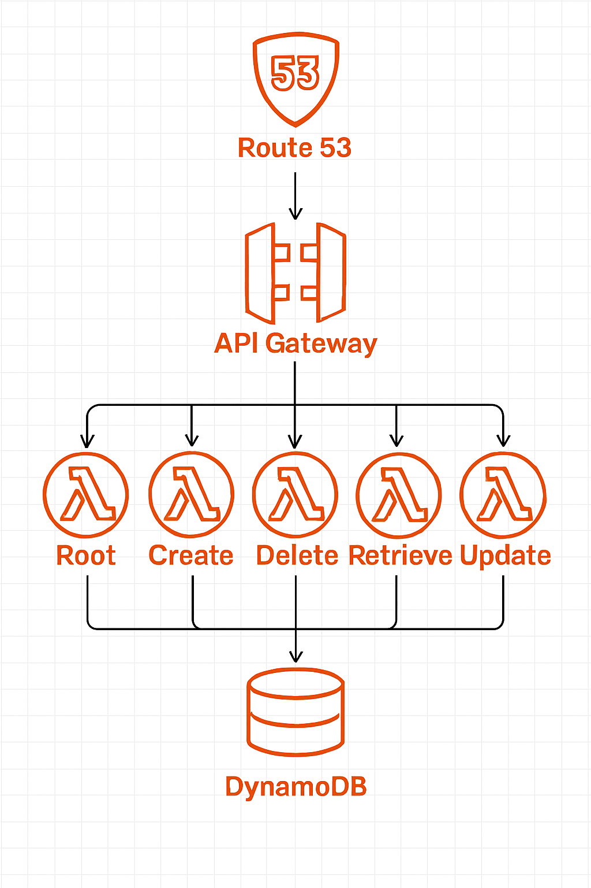

# HMCTS Dev Test Backend
This will be the backend for the brand new HMCTS case management system.
It has a Spring Boot application with a REST API for create, retrieve, update and delete operations.
We choose Eclipse Store as a repository, which offers a wide range of cost-effective and performant
options for hosting in the cloud.

Next to develop is a Lambda backend next to the Spring Boot.

We leave it up to the Stakeholders to decide what would be commercial the best technology.
The AWS Lambda technology tends to be very low-cost and low-maintenance, although
hosting a dockerised image with the Spring Boot application usually is also accepted as
a good low-cost option.

## 🔧Technology Stack
- **IntelliJ** IntelliJ IDEA 2025 (Community Edition)
- **Java 21**
- **Spring Boot 3**
- **Spring REST API**
- **Eclipse Store** with Spring adaptor, and local path as a persistence repository as per default
- **OpenAPI** with a Spring Documentation generator for API documentation
- **Swagger** for pretty API documentation and very basic browser based application client
- **Gradle 8** for build automation
- **Jakarta Bean Validation** for request validation
- **Lombok** for reducing boilerplate
- **JUnit 5 with Mockito** for testing
- **RestAssured** for functional testing
- **GitHub** for GIT versioning and various automatic code validations like checkstyle
- **CDK v2** AWS Cloud development kit to generate Cloud infrastructure from executing (java) sources.
- **Lambda** AWS Serverless, which is code that is running on provisioned, scaled, patched AWS infrastructure.
- **CoPilot** AI Generative tool

## ✅Prerequisites
- IDE like Eclipse or IntelliJ for coding and version management with GIT.
- Able to run `gradlew build` successfully.
- Able to run src\main\java\uk\co\frankz\hmcts\dts\Application.java.

### AWS prerequisites
- Registered domain name
- Certificate
- installed [AWS CDK CLI](https://docs.aws.amazon.com/cdk/v2/guide/getting-started.html)
- installed Node.js
- installed [AWS CLI](https://docs.aws.amazon.com/cli/latest/userguide/getting-started-install.html)
- configured profile for [AWS SSO](https://docs.aws.amazon.com/cli/latest/userguide/cli-configure-sso.html)

## 📖API Documentation
Running the Spring Boot application picks up properties in application.yaml, with which settings
it uses a persistence repository and generates documentation.

- **OpenAPI JSON**: http://localhost:4000/v3/api-docs
- **Swagger UI**: http://localhost:4000/swagger-ui.html


| object/field | Format     | Description                                                                                                                                                                                                                                  |
|----------------|------------|----------------------------------------------------------------------------------------------------------------------------------------------------------------------------------------------------------------------------------------------|
| TaskDto        | JSON       | Structure representing a Task entity, with fields id, description, due, status, and title.                                                                                                                                                   |
| id             | String     | Unique identifier, generated by the backend repository, typically a number string.<br/> Should be omitted for creating a Task.                                                                                                               |
| status         | String     | Task status, which can be "Initial" or "Deleted" in the first version of this implementation. <br/>Can be omitted at creation and then is defaulted to Initial.                                                                              |
| due            | String | Date and Time, in a ISO-8601 extended local or offset date-time format format,<br/> extended with a time zone indication. <br/>Example "2026-01-18T18:13:52.488Z".<br/>Can be omitted at creation and then is defaulted to the current time. |
| title          | String | Required non-blank field of a Task.                                                                                                                                                                                                          |
| description    | String | Optional (can be omitted) description of a Task.                                                                                                                                                                                             |

## 🏠️IDE Project structure

```
hmcts-dev-test-backend/
    ├── aws/                                              # AWS specific implementation
    │   ├── src/
    │   │   ├── main/
    │   │   │   └─ java/
    │   │   │      ├─  uk/co/frankz/hmcts/dts/aws/
    │   │   │      │   ├── lambda                         # AWS Serverless functions similar as Spring ctrl
    │   │   │      │   │   ├── BaseTaskHandler.java
    │   │   │      │   │   ├── RootTaskHandler.java
    │   │   │      │   │   ├── CreateTaskHandler.java
    │   │   │      │   │   ├── DeleteTaskHandler.java
    │   │   │      │   │   ├── UpdateTaskHandler.java
    │   │   │      │   │   └── RetrieveTaskHandler.java
    │   │   │      │   ├── dynamodb/                      # AWS DynamoDb database specifics
    │   │   │      │   │   ├── TaskWithId.java            # Entity with annotation gating id
    │   │   │      │   │   ├── TaskStoreImpl.java         # CRUD implementation for persistence
    │   │   │      │   │   ├── BaseConvertor.java         # convertor abstract class
    │   │   │      │   │   ├── StatusConverter.java       # convertor for Status enum
    │   │   │      │   │   ├── AutoUuidConverter.java     # convertor for UUID
    │   │   │      │   │   └── IsoDateTimeConverter.java  # convertor for ISO string of LocalDateTime
    │   │   │      │   ├── Mapper.java                    # Convertor between Dto antity with id
    │   │   │      │   ├── TaskService.java               # CRUD logic for task withfor DynamoDb
    │   │   │      │   ├── TaskProperties.java            # Constants for AWS implemtion
    │   │   │      │   └── TaskExceptionHandler.java      # Logic for exception display to user
    │   │   │      └── resources/
    │   │   │          └── log4j2.xml                     # Log4j config for (debug) log in lambda
    │   │   └── test/
    │   └── build.gradle                                  # Gradle tasks with shadowJar
    ├── img/                                              # pictures for read.me
    ├── src/
    │   ├── main/
    │   │   ├── java/
    │   │   │   ├── uk/co/frankz/hmcts/dts/spring/        # Implementation with Spring annotations
    │   │   │   │    ├── controller/                      # Spring Controllers for REST API
    │   │   │   │    │   ├── RootController.java
    │   │   │   │    │   ├── RootTaskController.java
    │   │   │   │    │   ├── CreateTaskController.java
    │   │   │   │    │   ├── DeleteTaskController.java
    │   │   │   │    │   ├── UpdateTaskController.java
    │   │   │   │    │   └── RetrieveTaskController.java
    │   │   │   │    ├── Mapper.java                      # Convertor between dto - entity/id (Spring)
    │   │   │   │    ├── TaskStore.java                   # CRUD impl Spring adaptor for Eclipse Store
    │   │   │   │    ├── TaskWithId.java                  # Task representing entity with id (Spring)
    │   │   │   │    ├── GlobalCorsConfig.java            # Spring CORS config
    │   │   │   │    ├── Application.java                 # Runnable Spring Boot application class
    │   │   │   │    ├── TaskService.java                 # CRUD logic for task with id (Spring managed)
    │   │   │   │    ├── TaskExceptionHandler.java        # Spring Controller Exception
    │   │   │   │    ├── RepositoryHealthIndicator.java   # Logic to check whether app should work
    │   │   │   │    └── TaskStoreEclipseStoreConfig.java # Configuration Spring adaptor for EclipseStore
    │   │   │   │
    │   │   │   └── uk/gov/hmcts/reform/dev/
    │   │   │       ├── models/
    │   │   │       │   └── ExampleCase.java              # Demo response
    │   │   │       ├── controllers/
    │   │   │       │   ├── CaseController.java           # Demo service
    │   │   │       │   └── RootController.java
    │   │   │       ├── Application.java                  # Demo app running on port 4000, for Frontend demo
    │   │   │       └── GlobalCorsConfig.java             # CORS support added for frontend
    │   │   │
    │   │   └── resources/
    │   │       └── application.yaml                      # Spring Boot properties, shared with HMCTS Demo
    │   ├── test/                                         # Unit tests
    │   ├── smokeTest/
    │   ├── functionalTest/                               # Functional tests
    │   │   └── java/
    │   │       └── uk/co/frankz/hmcts/dts/
    │   │           └── CrudTaskFunctionalTest.java       # Test to Create, Retrieve, Update and Delete over REST
    │   │
    │   └── integrationTest/                              # Integration tests with Health check of running app
    ├── assets/                                           # Project that works with AWS and CDK CLI commands
    ├── common/
    │   ├── src/
    │   │   ├── main/
    │   │   │   ├── java/uk/co/frankz/hmcts/dts/
    │   │   │   │   ├── dto/                              # Data Transfer Objects
    │   │   │   │   │   ├── Mapper.java                   # Common convertor between dto and model
    │   │   │   │   │   └── TaskDto.java                  # Task Data Transfer Object
    │   │   │   │   ├── model/                            # Application entities
    │   │   │   │   │   ├── exception/                    # Application exceptions
    │   │   │   │   │   │   ├── TaskException.java                # base exception for all app exceptions
    │   │   │   │   │   │   ├── TaskJsonException.java            # app exception for json (de-)serialisation
    │   │   │   │   │   │   ├── TaskStoreException.java           # app persistence exception
    │   │   │   │   │   │   ├── TaskNoMatchException.java         # app exception suggesting valid args
    │   │   │   │   │   │   ├── TaskNotFoundException.java        # App invalid identifier exception
    │   │   │   │   │   │   └── TaskInvalidArgumentException.java # App illegal argument exception
    │   │   │   │   │   │
    │   │   │   │   │   ├── Task.java                     # Model representing entity of a Task
    │   │   │   │   │   ├── ITask.java                    # Interface for task getters and setters
    │   │   │   │   │   ├── Status.java                   # Enum for status of a Task
    │   │   │   │   │   └── EntityWithId.java             # Interface generalisation for entity with id
    │   │   │   │   └── service/                          # Common functional code for Lambda and Spring impl
    │   │   │   │       ├── Action.java                   # Common http paths covered in Lambda and Spring
    │   │   │   │       ├── Header.java                   # Enum for headers in Http
    │   │   │   │       ├── TaskStore.java                # Common persistance interface for Lambda and Spring
    │   │   │   │       └── TaskService.java              # Common service interface for Lambda and Spring
    │   │   │   └── resources
    │   │   └── test/
    │   └── build.gradle
    ├── gradle/
    │   ├── wrapper/
    │   └── libs.versions.toml                            # Gradle version catalog
    ├── README.md
    ├── build.gradle
    ├── infrastructure/                                    # Project the produces the Jar for the Assets project
    │   └── src/
    │       ├── main/
    │       │   ├── java/uk/co/frankz/hmcts/dts/aws/infra/ # Infrastructure as (java) code for AWS components
    │       │   │    ├── CloudAssemblerApplication.java    # Application to start generating components
    │       │   │    ├── BackEndStack.java                 # Logic to generate all components for the app
    │       │   │    ├── BackEndComponent.java             # List of variables of components to generate
    │       │   │    ├── ProvisionedComponent.java         # List of variables of provisioned components
    │       │   │    ├── MyEnvironment.java                # AWS and CDK (local) environment settings
    │       │   │    ├── LambdaBuilder.java                # Logic to generate a Serverless Function (AWS Lambda)
    │       │   │    ├── DnsEntryBuilder.java              # Logic to generate a DNS entry (AWS Route53 entry)
    │       │   │    ├── LogGroupBuilder.java              # Logic to generate a Log location
    │       │   │    ├── SubDomainBuilder.java             # Logic to generate a sub domain for API Gateway
    │       │   │    ├── ApiGatewayBuilder.java            # Logic to generate AWS API Gateway component
    │       │   │    ├── LambdaRouteBuilder.java           # Logic to generate link API Gateway to Lambda
    │       │   │    ├── SubDomainCertFinder.java          # Logic to generate code to lookup the certificate
    │       │   │    ├── TableBuilder.java                 # Logic to generate a DynamoDb table
    │       │   │    └── CrossOriginResourcesBuilder.java  # CORS support
    │       │   └── resources
    │       └── test/
    │           ├── java
    │           └── resources/
    │               └── command.txt                        # Curl command to execute in Powershell
    ├── settings.gradle                                    # Gradle to allow module dependencies
```


## 🧪 Testing

### Unit Testing
The unit test code coverage is close to 100%. Not all Spring features are covered.


### Functional Testing
With Spring and a database repository, you would typical have a Spring test version for Functional tests.
With our choice of instead of a Spring repository, but Eclipse Store local file system repository,
we are not worried about integrating or smoke testing connections. The Functional test covers Integration and
Smoke Tests for development. Integration and Smoke Tests will be useful for production.

_CrudTaskFunctionalTest.java_ is runnable test, which starts up a Spring Boot for testing.
By changing the TEST_URL, the test runs against Spring Boot backend
(see [screenshot](img/functional-test-results-local-springboot.png)),
or against the AWS hosted backend (see [screenshot](img/functional-test-results-aws.png)).
AWS lambdas have a typical cold startup of 10 seconds, for which there are ways to speed up
which comes with a price tag.

## 🚀Deliverable
The deliverable is a Spring Boot application packages in htmcts-dev-test-backend jar file,
which also contains a resource application.yaml which declares endpoint port 4000.

This is a backend with a running REST API on a port, which consumes and produces string fields or JSON.

The relies on sufficient logging in the underlying Spring and Eclipse Store frameworks,
to handle service requests. Exceptions are wrapped into customised TaskExceptions,
which is intended to have more friendly information and not to reveal (for security concerns)
to much of the underlying framework.

## 🖧️Infrastructure
Often a Spring Boot back-end is provided as a Docker image, that can be uploaded into the
cloud. Typical, some tools are used to change the properties for that image, so that you can
have images for different environments, different customers, or environment with different databases.
Those tools are beyond my knowledge, and cannot provide them here.

I can provide an infrastructure for lambdas as code, and versioned, which I do in project _infrastructure_.
To deploy that, you need the AWS prerequisites mentioned here [above](#AWS-prerequisites).

### AWS Infrastructure



### CDK setup for Java-Gradle
The prerequisitis instruct to have a working AWS Component Development toolKit.

`cdk --version`

Should show the version of CDK that you have installed.

A _cdk.json_ file in _Assets_ project, tells the CDK Toolkit how to execute your app.
You generate this only once, by:
1. Navigate to Assets: `cd .\assets\`
2. and execute `cdk init --language java`.

#### CDK app line in _cdk.json_
After that, you need to edit _cdk.json_, to replace the maven command by a basic java command.
Just change the line to use basic Java to find the CDK application (mvn -e -q compile exec:java) with:

` "app": "java -jar infrastructure.jar -apiLambdaPath functions.jar -targetAccount <your account> -region <your region> -domainName <your domainname>",`

where
* _infrastructure.jar_   is the executable shadow jar with our CDK application
* _functions.jar_        is the shadow jar with our java compiled lambda code
* _your account_         is your AWS account number (see [below](#CDK-steps))
* _your region_          is something like eu-west-1
* _your domainname_      is your domain name (see [above](#AWS-prerequisites))

Not necessary, but because AWS has build CDK around Maven, and we do a setup for You can delete all a bit to prevent
it from pushing it up. (`delete ./assets/src`, `delete ./assets/pom.xml`)


The CDK deploy task relies on having Node.js installed.
The Gradle community has provided a
[plugin](https://github.com/kiiadi/gradle-cdk-plugin)
solution to use the Gradle node plugin instead, which I have not tried.


### CDK steps

The main _gradle.build_ should contain a task to generate a shadowJar named _functions.jar_, which contain
the functionality code plus runtime libraries.

1. `gradle shadowJar` to generate jars into the _Assets_ project folder.
   - _functions.jar_ with the main functionality
   - _infrastructure.jar_ with infrastructure components
1. Navigate to the _assets_ directory
2. Environment variable _CDK_DEFAULT_ACCOUNT_ should get set, automatically, during the session,
   in the background by CDK using AWS CLI to make a connection. To allow this you need to have
   an active AWS session:
   - (Once a day) `aws sso login`                creates a session for the day
   - (Optional) `aws sts get-caller-identity`    shows your account number
   - (Optional) `aws configure get region`       shows your region
2. The CDK Synthesise Step, generates Cloud Formation code.
   - `cdk ls` executes the [app](#CDK-app-line-in-_cdkjson_) line in _cdk.json_, which flushes out errors
   - `cdk synth`  executes [app](#CDK-app-line-in-_cdkjson_) and syntheses CloudFormation code in _cdk.out_
3. The CDK Deploy Step generates the components inside AWS, and an S3 bucket and IAM roles.
   As part of the Deploy Step, CDK will upload _functions.jar_ to populate the Lambda components.
   To prepare for that, you run, once per AWS account/region:
   - [Check your SSO user](img/AWS_Permissions.png)
   - (Only once ever) `cdk bootstrap <aws://account/region >` For example _aws://123456789012/us-east-1_
   - `cdk deploy`      executes [app](#CDK-app-line-in-_cdkjson_)  and deploys stack to your AWS account/region
   - `cdk diff`        compare deployed stack with current (local) state
4. To remove the application you can
   - `cdk destroy`                                 completely remove the app and stacks
   - Troubleshoot removal:
     * `aws s3 rm s3://<bucket name> --recursive`   if there is still something remaining in a generated
     * `aws logs describe-log-groups`               find out names of log groups that have been created
     * `aws logs delete-log-group --log-group-name /aws/lambda/<your lambda>`


With your AWS Management Console the components can be inspected, and AWS Lambdas can be tested with the
available Test button. The API Gateway can be tested with Curl commands,
like  `curl.exe -v https://domain/task`.


## 🤔Creative Effort Experience
Initial created TaskTest and model class through a TDD approach, then adding Spring MVC with Eclipse Store.
Spring typically drives one to use JPA for persistence, but I choose to use Eclipse Store, which might be
more suitable for small Serverless backend services, which I think this Task backend application likely
would be. Unfortunately, I learned further down, see below, that it did not live up to that promise.


That proved to be a learning curve, especially with testing and combination with Spring Boot.
With the Spring annotations and persistence requirements for Eclipse Store framework, the TDD approach
changed to Behavioural Driven Tests and a separation of types with Spring annotations in a package.
I have added a "life cycle" (Create, Retrieve, Update, Delete) functional test, using RestAssured, which
was new to me.

Then focussed on documentation and had to make a change in the sample framework to get my Controller classes
scanned by Swagger, by setting a property in application.yaml.
I also added an EclipseStore property that specifies the directory for the data repository.

To illustrate that Eclipse Store offers a wider range of repository types is in this
[screenshot](img/eclipsestore-targets.png) from the Eclipse Store reference manual.

However, the AWS support that EclipseStore has, does allow re-entrant database access, but not
distributed locking, as I hoped. So with EclipseSore you can have a lambda with just 1 instance
(which can be configured) but that defeats the role lambdas play, namely automatically increase/decrease
the number of available instances, depending how many requests there are.
Also the SpringBoot application can only have 1 running, and in case of SpringBoot constantly
active running, to avoid issues with multiple access on the same database from different instances.
Unless, and will work, when you explicitly use in our code, locking mechanisms that database providers give,
like Postgres Advisor.

I create a DynamoDB solution design, with the database access the bottleneck, so that I can demonstrate
a Serverless solution, or a migration strategy to a serverless solution in combination of DynamoDb.

AWS Lambda might be a technology preferred over Spring Boot, because it is (also event driven) code
which is running on provisioned, scaled, patched AWS infrastructure, and the cost is only the milliseconds
of the execution and the size of runtime framework. It integrates with a Gateway API for security
and DynamoDB as a distributed database, i.e. allows multiple back-end instances using the database
performant and reliable.

To get the AWS architectural diagram, I used Microsoft CoPilot to generate it from the question
_Give me an AWS architectural diagram of route53, apigateway, 5 lambdas, and a dynamodb table. The lambdas in
the diagram are labelled respectively "Root", "Create", "Delete", "Retrieve" and "Update". All lambdas, except
the lambda labelled "Root", connect to the table._. That image is shown above.

With deploying it, I realised that I have hard-coded my domain name and certificate
in _ProvisionedComponent.java_, which I do not see an easy way around that.

Then I spend many days to find out that the shadowJar that I produced contained Springboot and Logback
libraries that causes a not responding lambda. Those libraries load during invocation, causing a timeout
after 10 seconds. That made me splitting up the code in separate IDE/Gradle modules, so that controlling
what is in a shadowJar, is easier.

When I started developing the frontend, I noticed that the backend needs CORS support, which has been added
for Spring Boot apps and AWS Api Gateway.

## ✉ Acknowledgement and Support
Contact mailto:frankz@iae.nl for support.
