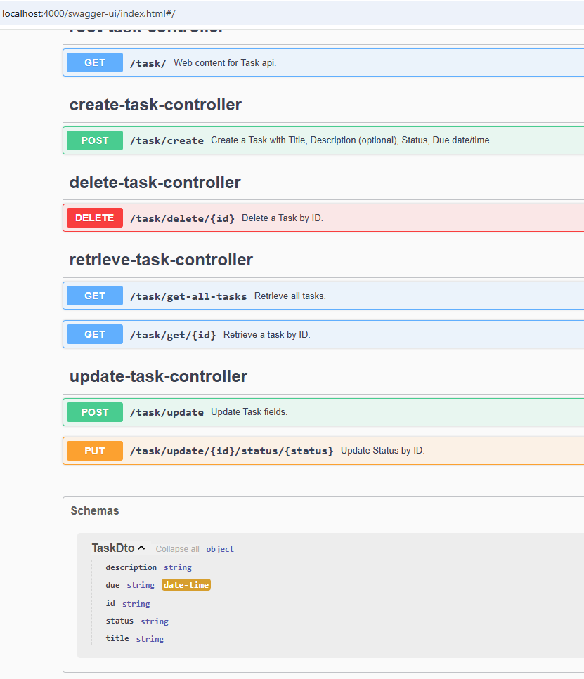
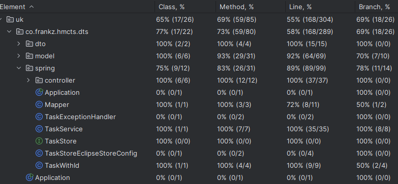
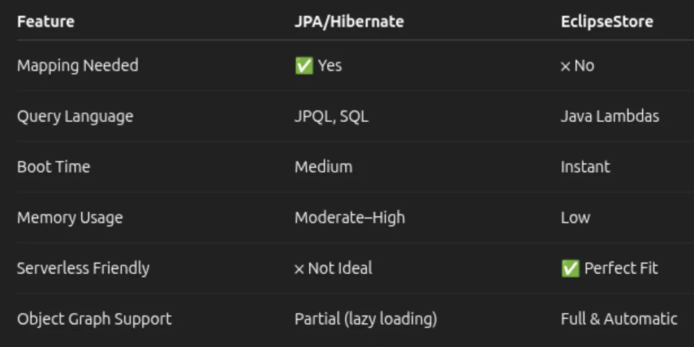

# HMCTS Dev Test Backend
This will be the backend for the brand new HMCTS case management system.
It has a Spring Boot application with a REST API for create, retrieve, update and delete operations.
We choose Eclipse Store as a repository, which offers a wide range of cost-effective and performant
options for hosting in the cloud.

Next to develop is a Lambda backend next to the Spring Boot.

We leave it up to the Stakeholders to decide what would be commercial the best technology.
The AWS Lambda technology tends to be very low-cost and low-maintenance, although
hosting a dockerised image with the Spring Boot application usually is also accepted as
a good low-cost option.

## 🔧Technology Stack
- **Java 21**
- **Spring Boot 3**
- **Spring REST API**
- **Eclipse Store** with Spring adaptor, and local path as a persistence repository as per default
- **OpenAPI** with a Spring Documentation generator for API documentation
- **Swagger** for pretty API documentation and very basic browser based application client
- **Gradle 8** for build automation
- **Jakarta Bean Validation** for request validation
- **Lombok** for reducing boilerplate
- **JUnit 5 with Mockito** for testing
- **RestAssured** for functional testing
- **GitHub** for GIT versioning and various automatic code validations like checkstyle
- **CDK v2** AWS Cloud development kit to generate Cloud infrastructure from executing (java) sources.
- **Lambda** AWS Serverless, which is code that is running on provisioned, scaled, patched AWS infrastructure.

## ✅Prerequisites
- IDE like Eclipse or IntelliJ for coding and version management with GIT.
- Able to run `gradlew build` successfully.
- Able to run src\main\java\uk\co\frankz\hmcts\dts\Application.java.

### AWS prerequisites
- Registered domain name
- Certificate
- installed [AWS CDK CLI](https://docs.aws.amazon.com/cdk/v2/guide/getting-started.html)
- installed [AWS CLI](https://docs.aws.amazon.com/cli/latest/userguide/getting-started-install.html)
- configured profile for [AWS SSO](https://docs.aws.amazon.com/cli/latest/userguide/cli-configure-sso.html)

## 📖API Documentation
Running the Spring Boot application picks up properties in application.yaml, with which settings
it uses a persistence repository and generates documentation.

- **OpenAPI JSON**: http://localhost:4000/v3/api-docs
- **Swagger UI**: http://localhost:4000/swagger-ui.html



| object/field | Format     | Description                                                                                                                                                                                                                                  |
|----------------|------------|----------------------------------------------------------------------------------------------------------------------------------------------------------------------------------------------------------------------------------------------|
| TaskDto        | JSON       | Structure representing a Task entity, with fields id, description, due, status, and title.                                                                                                                                                   |
| id             | String     | Unique identifier, generated by the backend repository, typically a number string.<br/> Should be omitted for creating a Task.                                                                                                               |
| status         | String     | Task status, which can be "Initial" or "Deleted" in the first version of this implementation. <br/>Can be omitted at creation and then is defaulted to Initial.                                                                              |
| due            | String | Date and Time, in a ISO-8601 extended local or offset date-time format format,<br/> extended with a time zone indication. <br/>Example "2026-01-18T18:13:52.488Z".<br/>Can be omitted at creation and then is defaulted to the current time. |
| title          | String | Required non-blank field of a Task.                                                                                                                                                                                                          |
| description    | String | Optional (can be omitted) description of a Task.                                                                                                                                                                                             |

## 🏠️IDE Project structure

```
src/
├── main
│   ├── java/uk
│   │   ├──co.frankz.hmcts.dts
│   │   │    └── aws/
│   │   │        ├── lambda/
│   │   │        │   └──CreateTaskHandler.java
│   │   │        │   └──...
│   │   │        └── DynamoService.java
│   │   │   ├──dto                                        # Data Transfer Objects
│   │   │   │  ├── Mapper                                 # Convertor between dto and model
│   │   │   │  └── TaskDto                                # Task Data Transfer Object
│   │   │   ├──model                                      # Application entities
│   │   │   │  ├──exception                               # Application exceptions
│   │   │   │  │  ├── TaskException.java                  # Generic app illegal argument exception
│   │   │   │  │  ├── TaskInvalidArgumentException.java   # Specific app argument exception
│   │   │   │  │  ├── TaskNotFoundException.java          # Specific app exception for task not found
│   │   │   │  │  └── TaskStoreException.java             # Wrapping persistence exception
│   │   │   │  ├── Status.java                            # Enum for status of a Task
│   │   │   │  └── Task.java                              # Model representing entity of a Task
│   │   │   └──spring                                     # Implementation with Spring annotations
│   │   │      ├──controller                              # Spring Controllers
│   │   │      │  ├── CreateTaskController.java
│   │   │      │  ├── DeleteTaskController.java
│   │   │      │  └── ...
│   │   │      ├── Application.java                       # Runnable Spring Boot application class
│   │   │      ├── Mapper.java                            # Convertor between dto and entity and id (managed by Spring)
│   │   │      ├── TaskExceptionHandler.java              # Spring Controller Exception
│   │   │      ├──TaskService.java                        # CRUD logic for task with id (managed by spring)
│   │   │      ├──TaskStore.java                          # CRUD implementation Spring adaptor for Eclipse Store
│   │   │      ├──TaskStoreEclipseStoreConfig.java        # Configuration Spring adaptor for Eclipse Store
│   │   │      └──TaskWithId.java                         # Task class representing entity with id managed by Spring
│   │   │
│   │   └──gov/hmcts/reform/dev                           # Original HMCTS Demo application
│   └──resources
│      └──application.yaml                                # Spring Boot properties, shared with HMCTS Demo
│
├── test                                                  # Unit tests
├── integrationTest                                       # Integration tests with Health check of running app
└── functionalTest                                        # Functional tests
    ├── CrudTaskFunctionalTest.java                       # Test to Create, Retrieve, Update and Delete over REST
    └── SampleFunctionalTest.java                         # Test for original HMCTS Demo app
```


## 🧪 Testing
The unit test code coverage is close to 100%. Not all Spring features are covered.


With Spring and a database repository, you would typical have a Spring test version for Functional tests.
With our choice of instead of a Spring repository, but Eclipse Store local file system repository,
we are not worried about integrating or smoke testing connections. The Functional test covers Integration and
Smoke Tests for development. Integration and Smoke Tests will be useful for production.


## 🚀Deliverable
The deliverable is a Spring Boot application packages in htmcts-dev-test-backend jar file,
which also contains a resource application.yaml which declares endpoint port 4000.

This is a backend with a running REST API on a port, which consumes and produces string fields or JSON.

The relies on sufficient logging in the underlying Spring and Eclipse Store frameworks,
to handle service requests. Exceptions are wrapped into customised TaskExceptions,
which menat to have more friendly information and not to reveal (for security concerns)
to much of the underlying framework.

## 🖧️Infrastructure
Often a Spring Boot back-end is provided as a Docker image, that can be uploaded into the
cloud. Typically some tools are used to change the properties for that image, so that you can
have images for different environments, different customers, or environment with different databases.
Those tools are beyond my knowledge, and cannot provide them here.

However, I can provide an infrastructure for lambdas, for which one needs the [](### AWS prerequisites)

### AWS Infrastructure


## 🤔Creative Effort Experience
Initial created TaskTest and model class through a TDD approach, then adding Spring MVC with Eclipse Store.
Spring typically drives one to use JPA for persistence, but I choose to use Eclipse Store, which might be
more suitable for small Serverless backend services, which I think this Task backend application likely
would be.



That proved to be a learning curve, especially with testing and combination with Spring Boot.
With the Spring annotations and persistence requirements for Eclipse Store framework, the TDD approach
changed to Behavioural Driven Tests and a separation of types with Spring annotations in a package.
I have added a "life cycle" (Create, Retrieve, Update, Delete) functional test, using RestAssured, which
was new to me.

Then focussed on documentation and had to make a change in the sample framework to get my Controller classes
scanned by Swagger, by setting a property in application.yaml.
I also added an EclipseStore property that specifies the directory for the data repository.

To illustrate that Eclipse Store offers a wider range of repository types is in this
[screenshot](img/eclipsestore-targets.png) from the Eclipse Store reference manual.

However, the AWS support that EclipseStore has, does allow re-entrant database access, but not
distributed locking, as I hoped. So with EclipseSore you can have a lambda with just 1 instance
(which can be configured) but that defeats the role lambdas play, namely automatically increase/decrease
the number of available instances, depending how many requests there are.
This also goes for a SpringBoot application. You can only have 1 running, and in case of SpringBoot constantly
active running, to avoid issues with multiple access on the same database from different instances.

So I will create a DynamoDB solution design, with the database access the bottleneck, so that I can demonstrate
a Serverless solution.

AWS Lambda is a technology preferred over Spring Boot, because it is (also event driven) code
which is running on provisioned, scaled, patched AWS infrastructure, and the cost is only the milliseconds
of the execution and the size of runtime framework. It integrates with a Gateway API for security
and DynamoDB as a distributed database, i.e. allows multiple back-end instances using the database
performant and reliable.

To get the AWS architectural diagram, I used Microsoft CoPilot to generate it from the question
_Give me an AWS architectural diagram of route53, apigateway, 5 lambdas, and a dynamodb table. The lambdas in
the diagram are labelled respectively "Root", "Create", "Delete", "Retrieve" and "Update". All lambdas, except
the lambda labelled "Root", connect to the table._.


## ✉ Acknowledgement and Support
Contact mailto:frankz@iae.nl for support.
